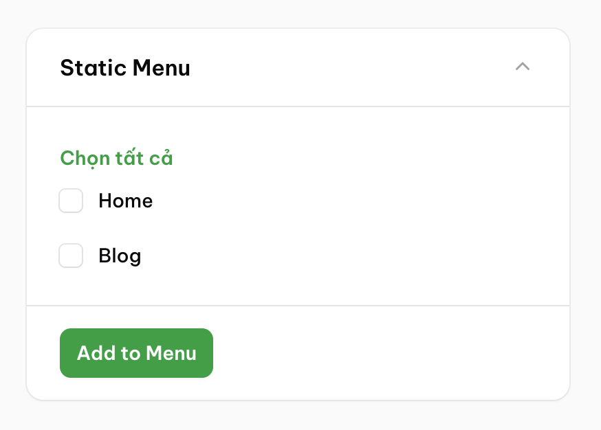
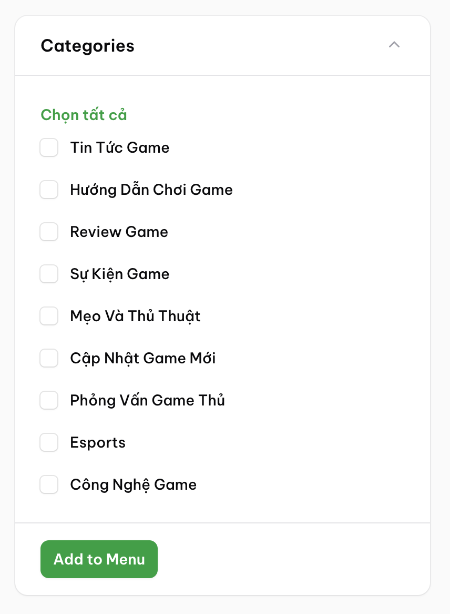

# Filament Menu Builder

[](https://packagist.org/packages/datlechin/filament-menu-builder)
[](https://packagist.org/packages/datlechin/filament-menu-builder)

This [Filament](https://filamentphp.com) package allows you to create and manage menus in your Filament application.


> [!NOTE]
> I created this for my personal project, so some features and extensibility are still lacking. Pull requests are welcome.

## Installation

You can install the package via composer:

```bash
composer require datlechin/filament-menu-builder
```

You need to publish the migrations and run them:

```bash
php artisan vendor:publish --tag="filament-menu-builder-migrations"
php artisan migrate
```

You can publish the config file with:

```bash
php artisan vendor:publish --tag="filament-menu-builder-config"
```

Optionally, if you want to customize the views, you can publish them with:

```bash
php artisan vendor:publish --tag="filament-menu-builder-views"
```

This is the contents of the published config file:

```php
return [
    'tables' => [
        'menus' => 'menus',
        'menu_items' => 'menu_items',
        'menu_locations' => 'menu_locations',
    ],
];
```

Add the plugin to `AdminPanelProvider`:

```php
use Datlechin\FilamentMenuBuilder\FilamentMenuBuilderPlugin;

$panel
    ...
    ->plugin(FilamentMenuBuilderPlugin::make())
```

## Usage

### Adding locations

Locations are the places where you can display menus in the frontend. You can add locations in the `AdminPanelProvider`:

```php
use Datlechin\FilamentMenuBuilder\FilamentMenuBuilderPlugin;

$panel
    ...
    ->plugin(
        FilamentMenuBuilderPlugin::make()
            ->addLocation('header', 'Header')
            ->addLocation('footer', 'Footer')
    )
```

The first argument is the key of the location, and the second argument is the title of the location.

### Setting up Menu Panels

Menu panels are the panels that contain the menu items which you can add to the menus.

### Custom Menu Panel

By default, the package provides a **Custom Link** menu panel that allows you to add custom links to the menus.


#### Static Menu Panel

The static menu panel allows you to add menu items manually.

```php
use Datlechin\FilamentMenuBuilder\FilamentMenuBuilderPlugin;
use Datlechin\FilamentMenuBuilder\MenuPanel\StaticMenuPanel;

$panel
    ...
    ->plugin(
        FilamentMenuBuilderPlugin::make()
            ->addMenuPanels([
                StaticMenuPanel::make()
                    ->add('Home', url('/'))
                    ->add('Blog', url('/blog')),
            ])
    )
```



### Model Menu Panel

The model menu panel allows you to add menu items from a model.

To create a model menu panel, your model must implement the `\Datlechin\FilamentMenuBuilder\Contracts\MenuPanelable` interface and `\Datlechin\FilamentMenuBuilder\Concerns\HasMenuPanel` trait.

Then you will need to implement the following methods:

```php
use Illuminate\Database\Eloquent\Model;
use Datlechin\FilamentMenuBuilder\Contracts\MenuPanelable;

class Category extends Model implements MenuPanelable
{
    public function getMenuPanelTitleColumn(): string
    {
        return 'name';
    }

    public function getMenuPanelUrlUsing(): callable
    {
        return fn(self $model) => route('categories.show', $model->slug);
    }
}
```

Then you can add the model menu panel to the plugin:

```php
use Datlechin\FilamentMenuBuilder\FilamentMenuBuilderPlugin;
use Datlechin\FilamentMenuBuilder\MenuPanel\ModelMenuPanel;

$panel
    ...
    ->plugin(
        FilamentMenuBuilderPlugin::make()
            ->addMenuPanels([
                ModelMenuPanel::make()
                    ->model(\App\Models\Category::class),
            ])
    )
```



### Custom Fields

In some cases, you may want to extend menu and menu items with custom fields. To do this, start by passing an array of form components to the `addMenuFields` and `addMenuItemFields` methods when registering the plugin:

```php
use Filament\Forms\Components\TextInput;
use Filament\Forms\Components\Toggle;
use Datlechin\FilamentMenuBuilder\FilamentMenuBuilderPlugin;

$panel
    ...
    ->plugin(
        FilamentMenuBuilderPlugin::make()
            ->addMenuFields([
                Toggle::make('is_logged_in'),
            ])
            ->addMenuItemFields([
                TextInput::make('classes'),
            ]),
    )
```

Next, create a migration adding the additional columns to the appropriate tables:

```php
use Illuminate\Database\Migrations\Migration;
use Illuminate\Database\Schema\Blueprint;
use Illuminate\Support\Facades\Schema;

return new class extends Migration
{
    /**
     * Run the migrations.
     */
    public function up(): void
    {
        Schema::table(config('filament-menu-builder.tables.menus'), function (Blueprint $table) {
            $table->boolean('is_logged_in')->default(false);
        });

        Schema::table(config('filament-menu-builder.tables.menu_items'), function (Blueprint $table) {
            $table->string('classes')->nullable();
        });
    }

    /**
     * Reverse the migrations.
     */
    public function down(): void
    {
        Schema::table(config('filament-menu-builder.tables.menus'), function (Blueprint $table) {
            $table->dropColumn('is_logged_in');
        });

        Schema::table(config('filament-menu-builder.tables.menu_items'), function (Blueprint $table) {
            $table->dropColumn('classes');
        });
    }
}
```

Once done, simply run `php artisan migrate`.

## Changelog

Please see [CHANGELOG](CHANGELOG.md) for more information on what has changed recently.

## Contributing

Please see [CONTRIBUTING](.github/CONTRIBUTING.md) for details.

## Security Vulnerabilities

Please review [our security policy](../../security/policy) on how to report security vulnerabilities.

## Credits

- [Ngo Quoc Dat](https://github.com/datlechin)
- [Log1x](https://github.com/Log1x)
- [All Contributors](../../contributors)

## License

The MIT License (MIT). Please see [License File](LICENSE.md) for more information.
